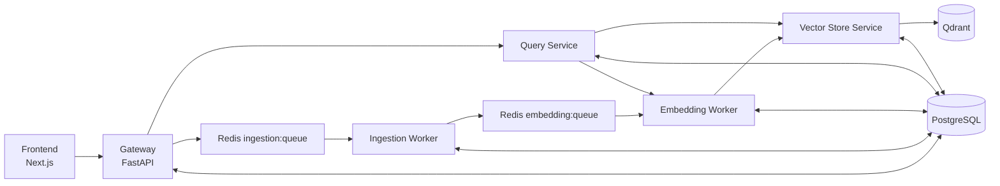

# Distributed RAG Core

[](https://docs.docker.com/compose/)
[](https://nextjs.org/)
[](https://fastapi.tiangolo.com/)
[](https://www.postgresql.org/)
[](https://qdrant.tech/)
[](https://redis.io/)

Distributed RAG Core is a production-style, microservice Retrieval-Augmented Generation platform for multimodal ingestion (text, PDF, image, audio, video), semantic retrieval, and model-flexible answering via Groq, Ollama, and Gemini.

## Why This Project

- Modular service boundaries for independent scaling and fault isolation.
- Async ingestion and embedding queues for stable throughput under load.
- Strong retrieval pipeline with reranking and grounding-oriented answer constraints.
- Full-stack experience with a modern Next.js UI and operational observability endpoints.

## Architecture At A Glance



## Repository Layout

- `frontend` - Next.js App Router UI (query, documents, scrape, ollama, system tabs).
- `gateway` - API ingress, upload and scrape endpoints, query proxy, health and metrics aggregation.
- `ingestion-worker` - file extraction and chunking pipeline, pushes embedding jobs.
- `embedding-worker` - embedding generation and vector upsert orchestration.
- `vector-store` - single ownership over Qdrant reads/writes plus search cache.
- `query-service` - retrieval, reranking, prompt orchestration, and provider dispatch.
- `shared` - shared SQL schema bootstrap.
- `scripts` - operational reset and cleanup utilities.
- `docker-compose.yml` - full local stack.
- `docker-compose.worker.yml` - optional remote worker scaling.
- `.env.example` - complete runtime configuration and tuning reference.

## Core Data Flows

### Upload

`frontend -> gateway -> ingestion:queue -> ingestion-worker -> embedding:queue -> embedding-worker -> vector-store -> qdrant`

### Website Scraping

`frontend -> gateway /api/websites/scrape -> document pipeline (same as upload)`

### Query

`frontend -> gateway /api/query -> query-service -> embedding-worker (/api/embed/text) -> vector-store (/api/vectors/search) -> provider (groq|ollama|gemini)`

## Stack

- Backend: FastAPI + Uvicorn (Python microservices)
- Frontend: Next.js 15 + React 19 + TypeScript
- Data and infra: PostgreSQL, Redis, Qdrant
- AI providers:
  - Embeddings: Gemini
  - Query-time LLMs: Groq, Ollama, Gemini
  - Multimodal extraction support: Whisper, OCR, optional vision models

## Quick Start

### 1) Prerequisites

- Docker Desktop (WSL2 backend recommended on Windows)
- Git
- Optional: Ollama if you want local inference/vision

### 2) Configure Environment

```powershell
Copy-Item .env.example .env
```

Set at minimum:

```env
GEMINI_API_KEY=your_key_here
```

Common optional variables:

```env
PUBLIC_HOST=localhost
GROQ_API_KEY=your_key_here
OLLAMA_URL=http://host.docker.internal:11434
```

### 3) Start Full Platform

```powershell
docker compose up -d --build
docker compose ps
```

### 4) Access

- Frontend: [http://localhost:3000](http://localhost:3000)
- Gateway health: [http://localhost:8000/health](http://localhost:8000/health)

## Service Endpoints (Highlights)

### Gateway (`:8000`)

- `GET /health`
- `POST /api/documents/upload`
- `GET /api/documents`
- `GET /api/documents/{doc_id}/status`
- `DELETE /api/documents/{doc_id}`
- `POST /api/websites/scrape`
- `POST /api/query`
- `GET /api/query/history`
- `GET /api/system/status`
- `GET /api/stats/queue`
- `GET /api/stats/overview`
- `POST /api/client/heartbeat`
- `GET /api/ollama/models`
- `POST /api/ollama/pull`
- `DELETE /api/ollama/models/{model_name}`
- `POST /api/ollama/test`

### Embedding Worker (`:8002`)

- `GET /health`
- `POST /api/embed/text`

### Vector Store (`:8003`)

- `GET /health`
- `GET /api/collections/info`
- `POST /api/vectors/upsert`
- `POST /api/vectors/search`
- `DELETE /api/vectors/{doc_id}`
- `GET /api/stats`

### Query Service (`:8004`)

- `GET /health`
- `GET /api/models`
- `POST /api/query`

## Data Model

Defined in `shared/init.sql`.

- `documents` - ingestion lifecycle and status tracking.
- `chunks` - extracted chunk payloads with metadata.
- `embedding_jobs` - async embedding work state.
- `query_logs` - query execution and model usage metadata.
- `api_keys` - reserved table for API key handling.

Document lifecycle:

`queued -> extracting -> chunking -> embedding -> done`

Failure path:

`failed` with `error_msg`.

## Remote Worker Scaling

Use `docker-compose.worker.yml` to add ingestion/embedding capacity on other machines.

Key requirements:

- `PUBLIC_HOST` points to the primary host running Redis/Postgres/Vector Store.
- `SHARED_UPLOADS_DIR` maps a path visible to remote ingestion workers at `/uploads`.
- Keep API keys and model settings aligned with the main stack.

Run:

```powershell
docker compose -f docker-compose.worker.yml up -d --build
```

## Frontend Development

From `frontend`:

```powershell
npm install
npm run dev
```

Other scripts:

```powershell
npm run build
npm run start
npm run lint
```

## Operations

### Logs

```powershell
docker compose logs -f
```

### Clear Runtime State

```powershell
python scripts/clear_database.py --yes
```

### Clear Vector Database Only

```powershell
python scripts/clear_vector_db.py --yes
```

## Troubleshooting

- Ingestion file access failures:
  - Verify uploads volume/path mapping, especially with remote workers.
  - Tune `INGESTION_FILE_RETRY_MAX` and `INGESTION_FILE_RETRY_DELAY_SEC`.
- Growing embedding backlog:
  - Increase `WORKER_CONCURRENCY` and/or run additional workers.
- Query latency spikes:
  - Increase `QUERY_EMBED_CONCURRENCY`.
  - Review provider timeouts and retry settings.
- Ollama model list empty:
  - Confirm `OLLAMA_URL` and model availability.
- LAN connectivity issues:
  - Verify `PUBLIC_HOST`, firewall rules, and reachable ports (`3000`, `8000`, and infra ports as needed).

## Verification Checklist

- All services are healthy in `docker compose ps`.
- Uploading files reaches final `done` status.
- Scrape creates documents that become queryable.
- Query succeeds with at least one provider.
- System tab reflects queue depth and service health.

## Additional Documentation

- `SETUP.md` provides detailed operations guidance and extended setup scenarios.
